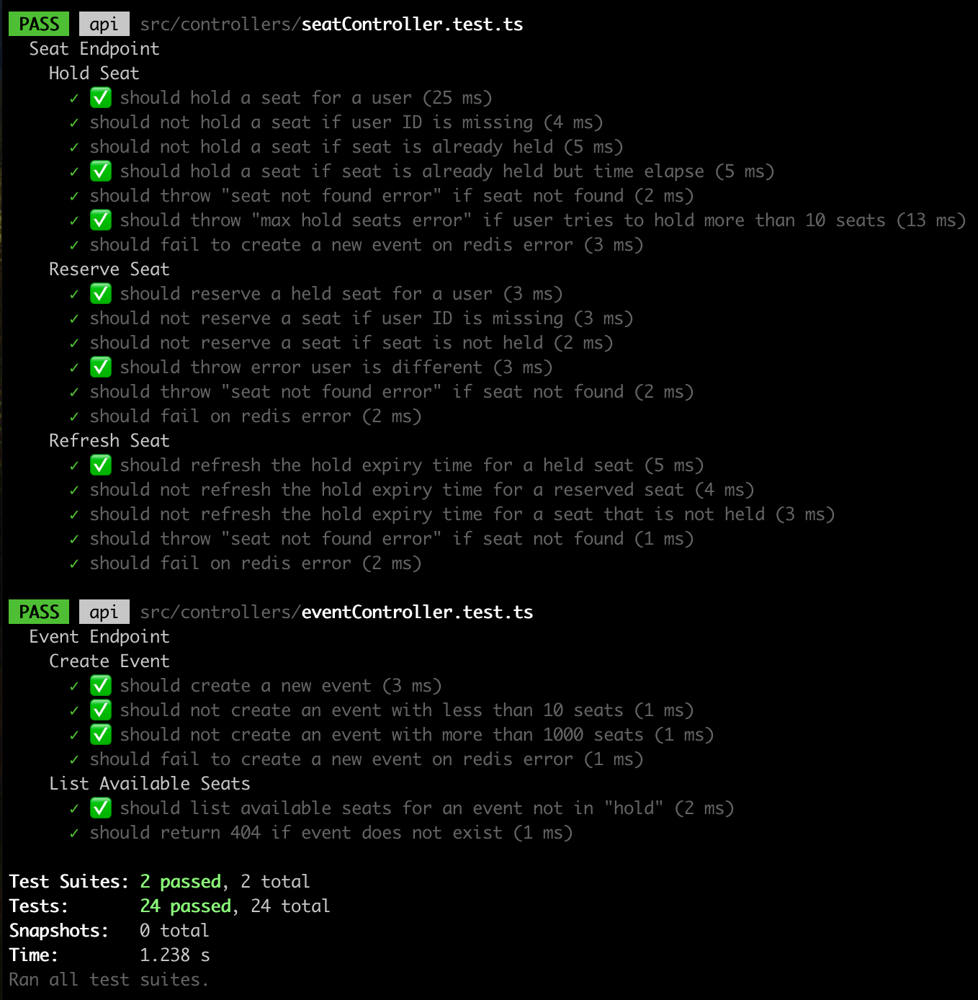
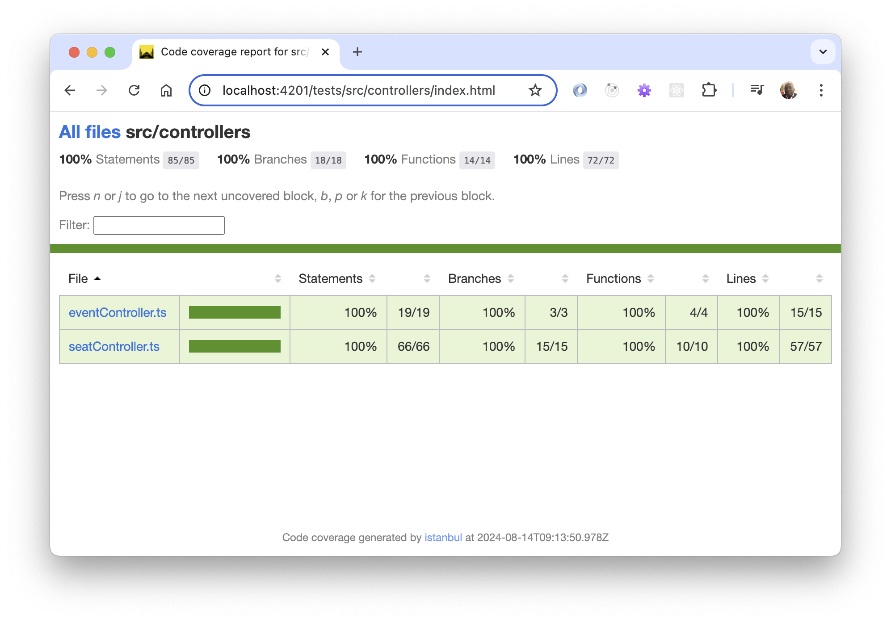
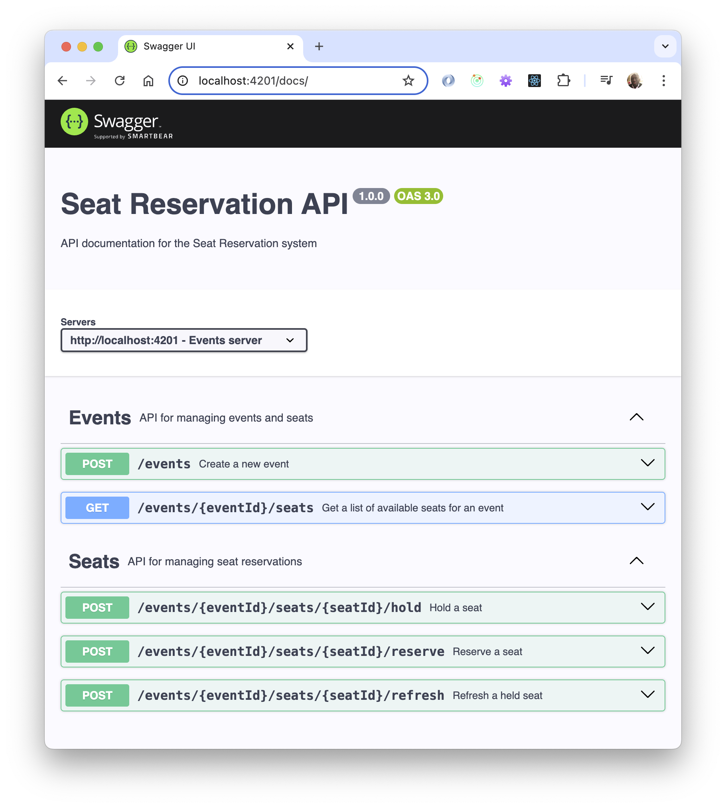

# Seat Reservation API

This is a RESTful API service for managing event seat reservations. The service allows you to create events, hold seats for users temporarily, reserve seats, and view available seats for an event.

## Features

- **Create an Event**: Create a new event with a specified number of seats.
- **List Available Seats**: Get a list of seats that are not currently held or reserved for a given event.
- **Hold a Seat**: Temporarily hold a seat for a user for a specified duration (default is 60 seconds).
- **Reserve a Seat**: Reserve a seat that has been held by the user.
- **Refresh a Seat**: Reserve a seat that has been held by the user to extend expiry time.

## Technology Stack

- **Node.js** with **Express.js**: Server-side application framework.
- **TypeScript**: Superset of JavaScript used for static typing.
- **Redis**: In-memory data structure store, used as a database and message broker.
- **Docker**: Containerization of the application.
- **Swagger**: API documentation.

Note that [nx](https://nx.dev/) is used for basic development environment.

## Prerequisites

Ensure you have the following installed:

- [Docker](https://www.docker.com/get-started)
- [Docker Compose](https://docs.docker.com/compose/install/)
- [Node.js](https://nodejs.org/en/) (for local development)
- [npm](https://www.npmjs.com/get-npm) (for local development)

## Setup and Installation

### Local Development (without Docker)

1. **Clone the repository**:

   ```bash
   git clone https://github.com/akann/events-booking.git
   cd events-booking
   ```

2. **Install dependencies**:

   ```bash
   npm install
   ```

3. **Start Redis**:
   Make sure Redis is running locally on default port 6379.

## Run the application

Run the following

```bash
npm start
```

## Access the API

The API will be available at <http://localhost:4201>.

## View API Documentation

Navigate to <http://localhost:4201/docs> to view the Swagger documentation.

## Testing the application

Run the following

```bash
npm test
```

Known issue: Unit test can be flaky due to jest timing. Rerun the tests if it fails.

Navigate to <http://localhost:4201/tests> to view tests report.

Unit tests result



Test coverage of key components


## Running with Docker

Clone the repository:

```bash
git clone https://github.com/akann/events-booking.git
cd events-booking
```

### Build and start the containers

```bash
docker-compose build
```

And subsequently

```bash
docker-compose up
```

To shut down the application

```bash
docker-compose down
```

Access the API

The API will be available at <http://localhost:4202>.

View API Documentation

Navigate to <http://localhost:4202/docs> to view the Swagger documentation.



## Available Endpoints

- POST `/events`: Create a new event.
- GET `/events/{eventId}/seats`: List all available seats for a given event.
- POST `/events/{eventId}/seats/{seatId}/hold`: Hold a seat for a user.
- POST `/events/{eventId}/seats/{seatId}/reserve`: Reserve a held seat for a user.
- POST `/events/{eventId}/seats/{seatId}/refresh`: Refresh hold time for a seat held by a user.

## Environment Variables

You can configure the application using the following environment variables:

- REDIS_HOST: Redis server hostname (default is localhost).
- REDIS_PORT: Redis server port (default is 6379).

## Testing the API

You can test the API using tools like Postman or cURL or [API docs](http://localhost:4202/docs)

## Conclusion

The application works as specified. If I spent more time I would have considered storing data in redis differently - doing validation in `EventModel`. Replacing the whole event each time is possibly not the best way to handle the event data.
